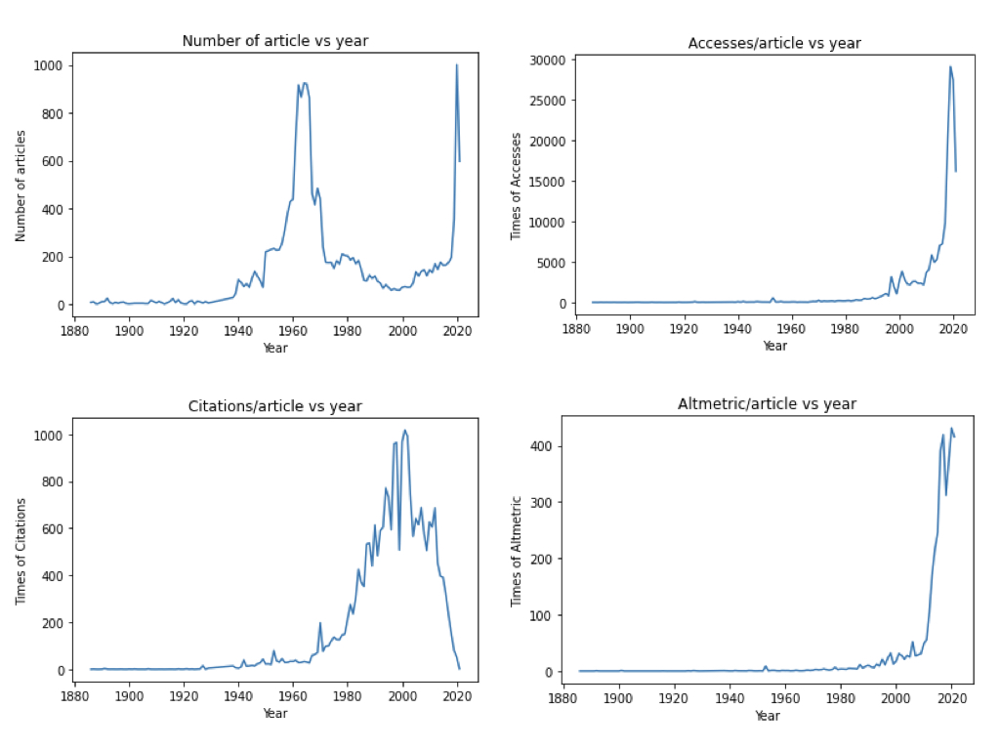
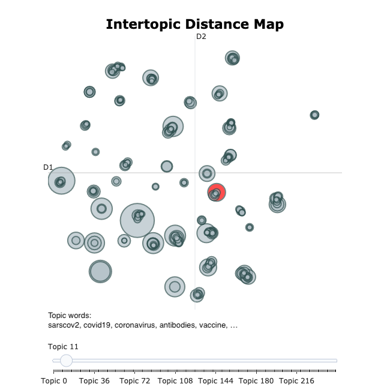
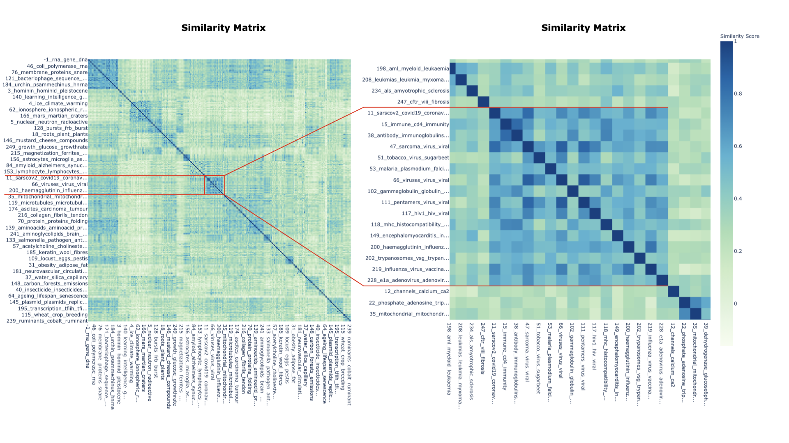
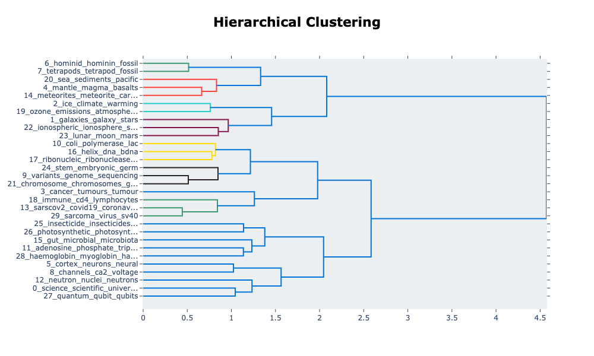
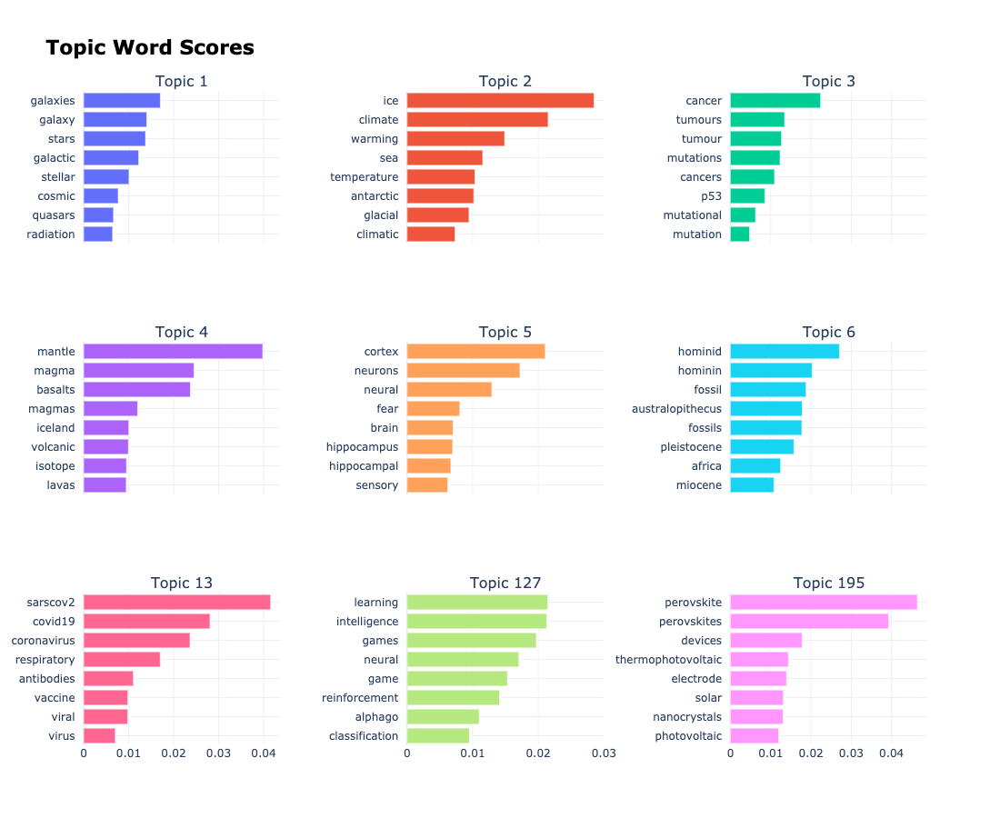
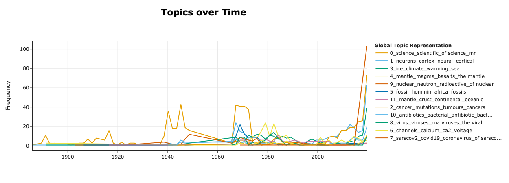
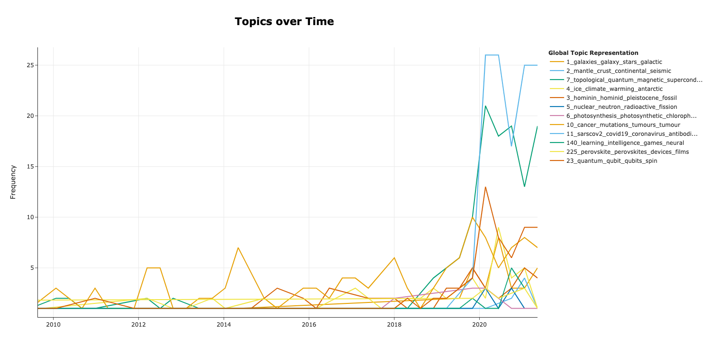

# Nature articles topic modelling
Topic modelling and analysis on Nature published articles since 1886.

* Scraped around 19760 articles from 1886 to 2021.
* Performed EDA on the numerical data and concluded that the pandemic indeed boosts the related researches.
* Utilized Bertopic to the extracted abstracts to investigate the subjects evolution along the history.


<!-- TABLE OF CONTENTS -->
## Table of Contents

* [About the project](#about-the-project)
* [Introduction](#introduction)

* [Results and discussion](#results-and-discussion)
  * [Exploratory data analysis](#eda)
  * [Topic modelling](#topic-modelling)
* [Conclusion](#conclusion)
* [Citation](#citation)
* [Supplimentary information](#supplimentary-info)   
  * [Notebooks](#notebooks)
  * [Scripts and tools](#scripts-and-tools)
  * [Supplementary data](#supplementary-data)
* [Contact](#contact)

<!-- ABOUT THE PROJECT -->
## About The Project

<!--  -->
[Nature](https://www.nature.com/) is one of the most cited scientific journals. Among different types of sections in an issue, [original research articles](https://www.nature.com/nature/articles?type=article) are original reports whose conclusions represent a substantial advance in understanding of an important problem and have immediate, far-reaching implications. The general articles information and corresponding article abstracts were obtained via a scraper. Based on these data, exploratory data analysis  and topic modelling was performed for further understanding the general scope of the evolutions of human interested knowledge.

<!-- INTRODUCTION -->
## Introduction
It is obvious that the covid-19 pandemic hindered the development of plenty areas, e.g. business, internationalism. At the beginning of the pandemic, some academic labs are closed and a lot of experiments are delayed. It's interesting to analyze whether the pandemic indeed slow down the development of academia and which subjects of academia are greatly affected.

To investigate on these problems, a scraper was designed to extract the information of Nature [original research articles](https://www.nature.com/nature/articles?type=article) from January, 1886 to September, 2021. The extract information includes the article title, published date, number of accesses, citations, altmetric of each paper, authors' affiliations, corresponding authors, digital object identifier(dois), subjects, and abstract. In total, there are 19923 items successfully scraped which were used for Exploratory Data Analysis(EDA). Among the 19923 articles, there is 8518 articles with no abstract whose abstract is further filled with titles. Meanwhile, some meaningfulness and short abstracts were filtered out. The left 16364 abstracts were used for topic modelling.

<!-- Discussion and results -->
## Results and discussion

### Exploratory Data Analysis
As mentioned in the Introduction section, 19923 article information were used for EDA. Let's start with the overview of the whole dataset.

<figure align="center">
  
  <figcaption>Fig. 1 Overview of the 19923 articles' metric information.</figcaption>
</figure>

>These figures are generated based on the summary of the overall accessibility. Overall published number of articles each year is shown in up left in Figure 1. Accesses per article shown on top right indicates the number of times an article has been accessed on average each year. Citation per article shown on bottom left suggests the number of times an article has been cited on average each year. Altmetric per article on the bottom right records the online attention the corresponding paper received. The source of the online attention was mainly contributed from social media and mainstream news. 

We can conclude that expect for those newly developed theories/techniques, many areas which somehow related with covid-19 are blooming starting from the end of 2019.

### Topic Modelling

At the stage of information explosion era, topic modelling becomes essential for understanding of unstructured data. Nature research articles provide the highly focused and trustable multidisciplinary presentations of the essence of human knowledge.

After fit and transform, Bertopic generated corresponding embedding space which can be utilized for further analysis. First of all, it's important to know how many topics over the 16276 articles from 1886 to 2021 inside the interested text data. There are 247 topics recognized from the abstract pool. For illustration, the first 6 frequent topics and three more specific topics are presented in Fig. 1.

<figure align="center">
  
  <figcaption>Fig. 1 2D topic  distribution map of the generated 247 topics based on 16364 abstracts.</figcaption>
</figure>

>The 2D distribution map was generated via the UMAP which reduced the high dimension embedding space to 2 dimensional space. Each circle represents one topic recognized by Bertopic. The diameter of each circle indicates the size of the corresponding topic (Number of abstracts sorted to this category.) The red circle is the topic 12 and accompanied with the corresponding topic words.

The complete topics generated can be found in the supplementary information section.


According to the cosine similarity of topic embeddings, a heatmap is generated shown the similarities among all the detected topics. As we can see in the Figure 2(left), that the topics are sorted to groups based on the similar semantics. Focusing on the central blue block which is enlarged and shown in Figure 2(right), this cluster is describing covid-19 related topics which including the areas of immunity, sarscov2 related viruses and corresponding treatments.

 <figure align="center">
   
   <figcaption>Fig. 2 Similarity matrix shown the close relationship among the topics.</figcaption>
 </figure>

 >Each topic is encoded to a 384 dimensional embedding. Hierarchical clustering is performed based on the topic embedding matrix. Here, number of clusters is set to 15. These settings lead to the corresponding grouped topic similarity matrix as shown in Figure 2. The enlarged area in left side of Figure 2 gives the details of the similarity matrix of a cluster which meaningfully sorted the related topics together.

 To trace the origins or the close relationship of similar topics, the dendrogram of Hierarchical clustering is generated for a close look in Figure 3.  

 <figure align="center">
   
   <figcaption>Fig. 3 A close look at the top 30 topics in the form of hierarchical clustering.</figcaption>
 </figure>

 >The hierarchical clustering dendrogram is shown in Figure 3 which provides a overview of the relationships in a granular perspective among the top 30 topics. It's intriguing to focus on the yellow elements: cancer(topic 10) and immune(topic 15) merge to a branch which further merge with sasrscov2(topic 11). Meanwhile, the parallel black elements: variants(topic 14) and chromosome(topic 25) merge to evolution(topic 29). Together, this branch farther meet the yellow branch. It is obvious that these two branches talk about the viruses and immunity.

 When plotting the whole hierarchical distribution among all the topics, it is reasonable to reset the number of clusters to generate a corresponding similarity matrix as in Figure 2.


To be more specific, in Figure 4, we present the top 6 topics in terms of topic size and three more topics in the form of topic word scores(c-TF-IDF). The last three topics were searched by cosine similarity via the keywords: covid, deep learning and perovskite. Figure 4 lists the resulting topics of interest.

<figure align="center">
  
  <figcaption>Fig. 4 Topics of interest are presenting together with the topics words and the corresponding c-TF-IDF scores.</figcaption>
</figure>

>Topics were generated via pre-trained sentence transformer model: paraphrase-MiniLM-L6-v2. The nine topics of interest were used to evaluate the  quality of the pre-trained sentence transformer. Among the tested 5 pre-trained models, paraphrase-MiniLM-L6-v2 gives the best prediction based on the accuracy and meaningfulness of the topic words with respect to the focused 9 topics.

From the listed 9 topic words for each sub-figure, it is obviously conclude the main idea of the corresponding topic. For topic 11, the highest c-TF-IDF score word is sarscov2 which is exactly the virus name caused the pandemic. The second topic word covid19 is the name of the disease caused by sarscov2. Coronaviruses are a diverse group of viruses, and sarscov2 is one specific virus belonging to coronavirus. The following topic words, antibodies and vaccine also give a very good supplementary information to understand the topic 11. Vaccines simulate the immune system to produce target antibodies to defeat viruses. As mentioned before, topic 140 is found by searching keyword: deep learning. Compared with other listed topic words in Figure 4, the first 6 topic words for topic 140 have much high c-TF-IDF scores which are more representatively describing the main idea of topic 140. Learning to become intelligent is the task of deep learning area. Meanwhile, neural elements are the base of deep learning architectures. Currently, many advanced deep learning techniques are reflected via the intelligence playing games. Perovskite related researches are blooming since 2014 it was first found being used as dye to absorbing sunlight. Plenty papers were published to investigate the electroluminescent and photovoltaic properties of perovskite materials. Moreover, researches on crystallizations of the perovskite and architectures of integrated devices are all emerging recent years. In summary, it is found meaningfully that the Bertopic model can give good representations of topics based on the scrapped data.


Usually, topic modelling is static presentation for the understanding of the whole unstructured text data. However, we know that the topics vary with time. It will be very interesting to discover the topic evolution over the time. In this situation, it might be possible to foreseen the future of the human beings. Luckily, Bertpic provides dynamic topic modelling which is utilized for the scrapped abstracts as shown below in Figure 5.

<figure align="center">
  
  <figcaption>Fig. 5 Dynamic topic modelling showing the evolutions of topics over 148 years published by Nature journal.</figcaption>
</figure>

>Bertpic provides dynamic topic modelling which is utilized for the scraped abstracts. Based on the fitted topic embeddings, abstracts are grouped and aggregated via topic numbers and timestamps. Then, for each unique timestamp, c-TF-IDF calculations are performed to all the grouped documents in the specific timestamp. Hence, the topics over time can be generated which is shown in above figure.

Here, as discussed before, the 9 topics are chose to illustrate the evolutions. In addition, three more topics: 7, 10, 23 are also presented in the Figure 5 due to the sharp increase around recent years. Between 1960s and 1980s, topics about galaxies, photosynthesis, nuclear, hominin, mantle and climate leading the categories.
It is interesting to conclude that, around 50 years ago, people were trying to understand the universe and nature, macroscopically and microscopically. People were exploring about the origins/functionalities of plants, animals. In the 20th century, above topics cooled down. At the beginning of 20th century, topic 10 started to increase which covering the research related with cancer, mutations and tumours. This might be a signal that indicates the human focused on human body inner understanding, macroscopically, health care. Meanwhile, the cooled old climate topic started rising again, probably due to the industrial development, global warming came along with some detrimental problems. Climate become a hot topic after 1960s initial understanding.  In recent 15 years, new topics were appearing, and the slopes of the frequencies of these topics are never seen of all ages. In Figure 6, more granular of topic evolutions in most recent 10 years is presented.


Among the most recent topics, sarscov2 is roaring to the first position with a unprecedented frequency over 148 years since the first appearance in late 2019. Followed by the topological-related topic. Topological materials promise potentially revolution in energy utilization, and especially, quantum computing area. In accordance with expectations, quantum, qubit-related topic are just chasing below. Besides, cancer, global climating related topic follow. It is important to note here that the deep learning related topics are also starting to rise.

<figure align="center">
  
  <figcaption>Fig. 6 Topic modelling presentation from 2010.</figcaption>
</figure>

>Figure 6 presents dynamic topic modelling result from 2010. The result was generated via setting number of bins to 444 which present the topics over time in terms of seasonal representation. More granular topic evolution trendings can be found in this figure.


## Conclusion
EDA clearly suggests that instead of hindering the development of academia, the pandemic expands and accelerate areas related with SARS‑CoV‑2.
From the results of topic modelling, it is intriguing to overview the topic evolutions over the 148 years which closely related with human beings' development and can be foreseen the futher areas that human will focused on.

## Supplimentary information
For more details of this project, please check the information listed below.
  * [Notebooks](#notebooks)
  * [Scripts and tools](#scripts-and-tools)
  * [Supplementary data](#supplementary-data)

## Citation

```bibtex
@article{devito2020we,
  title={How we learnt to stop worrying and love web scraping},
  author={DeVito, Nicholas J and Richards, G and Inglesby, Peter},
  journal={Nature},
  volume={585},
  year={2020},
  publisher={Nature Research}
}
```

```bibtex
@misc{grootendorst2020bertopic,
  author = {Maarten Grootendorst},
  title = {BERTopic: Leveraging BERT and c-TF-IDF to create easily interpretable topics.},
  year  = 2020,
  publisher = {Zenodo},
  version = {v0.7.0},
  doi = {10.5281/zenodo.4381785},
  url = {https://doi.org/10.5281/zenodo.4381785}
}
```
## Contact
