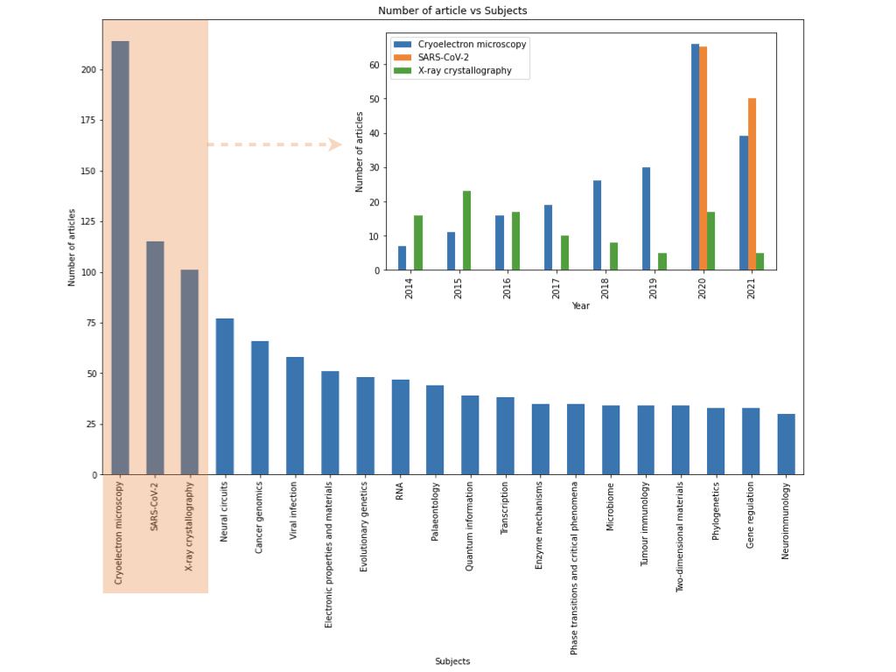
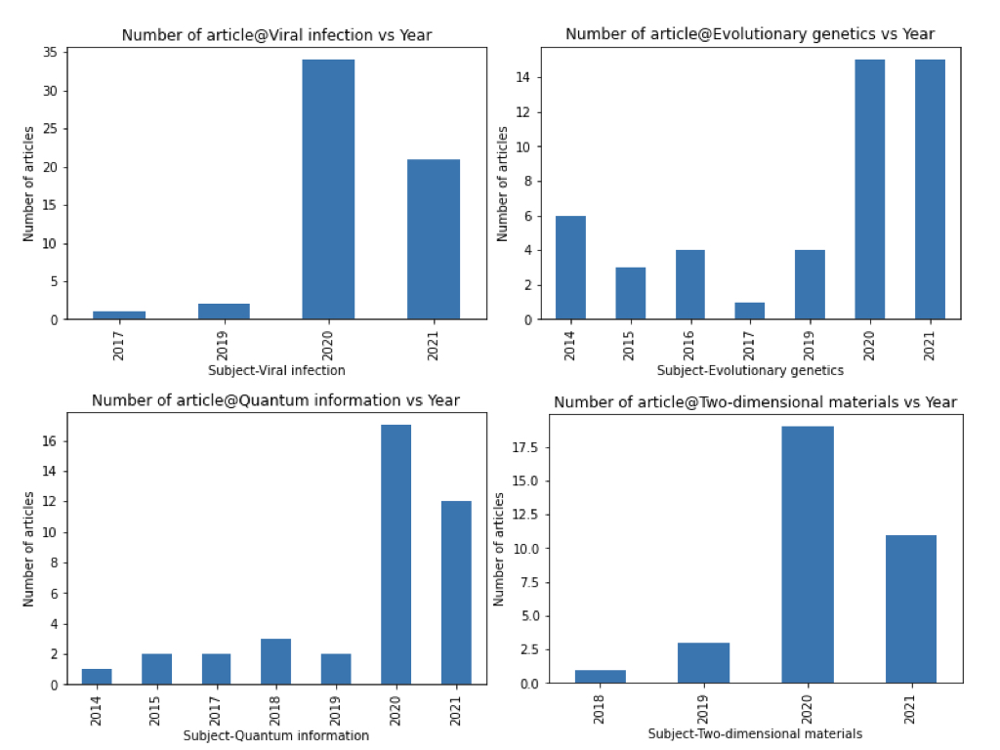

# Nature articles topic modelling
Topic modelling and analysis on Nature published articles since 1886.

* Scraped around 19760 articles from 1886 to 2021.
* Performed EDA on the numerical data and concluded that the pandemic indeed boosts the related researches.
* Utilized Bertopic to the extracted abstracts to investigate the evolution of the subject around 148 years.


<!-- TABLE OF CONTENTS -->
## Table of Contents

* [About the project](#about-the-project)
* [Introduction](#introduction)

* [Results and discussion](#results-and-discussion)
  * [Exploratory data analysis](#eda)
  * [Topic modelling](#topic-modelling)
* [Conclusion](#conclusion)
* [Citation](#citation)
* [Supplimentary information](#supplimentary-info)   
  * [Notebooks](#notebooks)
  * [Scripts and tools](#scripts-and-tools)
  * [Supplementary data](#supplementary-data)
* [Contact](#contact)

<!-- ABOUT THE PROJECT -->
## About The Project

<!--  -->
[Nature](https://www.nature.com/) is one of the most cited scientific journals. Among different types of sections in an issue, [original research articles](https://www.nature.com/nature/articles?type=article) are original reports whose conclusions represent a substantial advance in the understanding of an important problem and have immediate, far-reaching implications. The general articles information and corresponding article abstracts were obtained via a scraper. Based on these data, exploratory data analysis and topic modelling were performed for further understanding the general scope of the evolutions of human interested knowledge.

<!-- INTRODUCTION -->
## Introduction
The covid-19 pandemic hindered the development of plenty areas, e.g. business, internationalism. At the beginning of the pandemic, some academic labs are closed and a lot of experiments are delayed. It's interesting to analyze whether the pandemic indeed slows down the development of academia and which subjects of academia are greatly affected.

To investigate these problems, a scraper was designed to extract the information of Nature [original research articles](https://www.nature.com/nature/articles?type=article) from January 1886 to September 2021. The extract information includes the article title, published date, number of accesses, citations, altmetric of each paper, authors' affiliations, corresponding authors, digital object identifier(dois), subjects, and abstract. In total, there are 19923 items successfully scraped which were used for Exploratory Data Analysis(EDA). Among the 19923 articles, there are 8518 articles with no abstract whose abstract is further filled with titles. Meanwhile, some meaningfulness and short abstracts were filtered out. The left 16364 abstracts were used for topic modelling.

<!-- Discussion and results -->
## Results and discussion

### Exploratory Data Analysis
For the EDA part, we focus on the discussion about the article metrics and corresponding tagged subject terms. The corresponding statistic illustrations are plotted in Figure 1. The number of research articles per year published in Nature is plotted in Figure 1(a). The two spikes around 1960 and 2020 indicate there are a large number of articles published in these periods. There is no decrease in the number of publications since the starting of the pandemic. Interestingly, the access count of articles in Figure 1(b) is inconsistent with this trend. This phenomenon might is due to the small number of researchers and low accessibility to research journals and the internet in the 1960s. The citation count per article in Figure 1(c) shows a steady increase from the 1970s and then a decreasing trend from 2000. These changings are closely related to the number of articles published each year. With the rise of social media in the early 2000s, the altmetric data starts roaring in Figure 1(d) suggests the success of broadcasting the Nature's aim and scope to the wider public.

<figure align="center">
  
  <figcaption>Fig. 1 Overview of the 19923 articles' metric information.</figcaption>
</figure>

>These figures are generated based on the summary of the scrapped numerical information. Accesses per article shown on the top right indicates the number of times an article has been accessed on average each year. Citation per article shown in Figure 1(c) suggests the number of times an article has been cited on average each year. Altmetric per article In Figure 1(d) records the online attention the corresponding paper received. The source of the online attention was mainly contributed from social media and mainstream news.

Starting from 2010, each article published in Nature has been tagged with one or more subject terms which potentially can provide more statistical information other than the content of the corresponding paper. Here, we scrapped all subject terms of each paper. Then, we count the appearance of single-subject term per year and plot the results in Figure 2 which renders an overview of the distribution of the subjects. This overview illustration can give a comprehensive summary of the main subjects over the years. Undoubtedly, the keywords: SARS-CoV-2, RNA, Viral infection, etc. are directly related to the pandemic. However, the number of articles tagged with Cryoelectron microscopy is the largest. And the X-ray crystallography is the third-largest category. In the sub-figure, the number of articles vs specific subjects(top three subjects) was plotted for further understanding the development of the mentioned areas. It's obvious that the SARS-CoV-2 is a completely new subject starting from 2020 which a huge amount of publications. Interestingly, the number of publications related to Cryoelectron microscopy steadily increases since 2014 and roars to the most frequent subject in 2020. Meanwhile, research on X-ray crystallography decreases from 2015, but experiences a steep increase also in 2020. Intuitively, these two areas are closely affected by the pandemic positively. Previously, Cryoelectron microscopy was utilized for determining the 3D structure of the virus. And X-ray crystallography was widely utilized for determining the Crystalline structure at the atomic and molecular levels. Based on the references, these two techniques or combination of Cryoelectron microscopy and X-ray crystallography will reveal the mystery of the interactions of the spike protein of SARS-CoV-2 and the cell receptor which consistently explains the information we obtained from Figure 2.

<figure align="center">
  
  <figcaption>Fig. 2 Number of articles vs corresponding subject. In the sub-figure, the decomposed number of articles vs three specific subjects over the record years is illustrated.</figcaption>
</figure>

>Pandas stack method is used to split multiple subject terms assigned in one article. Then, count the appearance of each subject per year. Based on the total number of subject terms (corresponding to the number of articles related to the mentioned subject), plot the result of the top 20 subject terms from 2010.

Besides the above discussion about the top three subjects, four interesting subjects are also listed in Figure 3 as below. Viral infection and evolutionary genetics are closely related to the pandemic. So it's reasonable to conclude that the pandemic is responsible for the spike in 2020 for the top two sub-figures shown in Figure 3. Intriguingly, there are also many areas unrelated to pandemic blooming especially in 2020. For example, in Figure 3(c), the quantum information area shows a very sharp spike in 2020. This spike is related to the development of the quantum computing field. It's not surprising to find the appearance of the spike in two-dimensional materials areas plotted in Figure 3(d) due to the quantum properties obsessed by 2D materials is promising for the development of quantum computers.

<figure align="center">
  
  <figcaption>Fig. 3 Overview of the 19923 articles' metric information.</figcaption>
</figure>

>From the top 30 subject terms, four subjects are picked for illustration to show the impact of the pandemic for the development of covid related and unrelated ares.

 Above all, we can safely conclude that the pandemic not only accelerates the virus related areas, but does not effect on the progress of other new emerging areas as well.

### Topic Modelling

At the stage of the information explosion era, topic modelling becomes essential for the understanding of unstructured data. Nature research articles provide the highly focused and trustable multidisciplinary presentations of the essence of human knowledge.

After fit and transform, Bertopic generated corresponding embedding space which can be utilized for further analysis. First of all, it's important to know how many topics over the 16276 articles from 1886 to 2021 are inside the interested text data. There are 247 topics recognized from the abstract pool. For illustration, the first 6 frequent topics and three more specific topics are presented in Figure. 4.

<figure align="center">
  
  <figcaption>Fig. 4 2D topic  distribution map of the generated 247 topics based on 16364 abstracts.</figcaption>
</figure>

>The 2D distribution map was generated via the UMAP which reduced the high dimension embedding space to 2-dimensional space. Each circle represents one topic recognized by Bertopic. The diameter of each circle indicates the size of the corresponding topic (Number of abstracts sorted to this category.) The red circle is topic 12 and accompanied by the corresponding topic words.

The complete topics generated can be found in the supplementary information section.


According to the cosine similarity of topic embeddings, a heatmap is generated to show the similarities among all the detected topics. As we can see in the Figure 2(left), that the topics are sorted into groups based on similar semantics. Focusing on the central blue block which is enlarged and shown in Figure 2(right), this cluster is describing covid-19 related topics which including the areas of immunity, SARS‑CoV‑2 related viruses and corresponding treatments.

 <figure align="center">
   
   <figcaption>Fig. 5 Similarity matrix shown the close relationship among the topics.</figcaption>
 </figure>

 >Each topic is encoded to a 384-dimensional embedding. Hierarchical clustering is performed based on the topic embedding matrix. Here, the number of clusters is set to 15. These settings lead to the corresponding grouped topic similarity matrix as shown in Figure 2. The enlarged area on left side of Figure 2 gives the details of the similarity matrix of a cluster which meaningfully sorted the related topics together.

 To trace the origins of the close relationship of similar topics, the dendrogram of Hierarchical clustering is generated for a close look in Figure 3.  

 <figure align="center">
   
   <figcaption>Fig. 6 A close look at the top 30 topics in the form of hierarchical clustering.</figcaption>
 </figure>

 >The hierarchical clustering dendrogram is shown in Figure 3 which provides an overview of the relationships in a granular perspective among the top 30 topics. It's intriguing to focus on the yellow elements: cancer(topic 10) and immune(topic 15) merge to a branch that further merges with sasrscov2(topic 11). Meanwhile, the parallel black elements: variants(topic 14) and chromosome(topic 25) merge to evolution(topic 29). Together, this branch meets the yellow branch. It is obvious that these two branches talk about viruses and immunity.

 When plotting the whole hierarchical distribution among all the topics, it is reasonable to reset the number of clusters to generate a corresponding similarity matrix as in Figure 2.


To be more specific, in Figure 4, we present the top 6 topics in terms of topic size and three more topics in the form of topic word scores(c-TF-IDF). The last three topics were searched by cosine similarity via the keywords: covid, deep learning and perovskite. Figure 4 lists the resulting topics of interest.

<figure align="center">
  
  <figcaption>Fig. 7 Topics of interest are presenting together with the topics words and the corresponding c-TF-IDF scores.</figcaption>
</figure>

>Topics were generated via pre-trained sentence transformer model: paraphrase-MiniLM-L6-v2. The nine topics of interest were used to evaluate the quality of the pre-trained sentence transformer. Among the tested 5 pre-trained models, paraphrase-MiniLM-L6-v2 gives the best prediction based on the accuracy and meaningfulness of the topic words with respect to the focused 9 topics.

From the listed 9 topic words for each sub-figure, it is obviously concluded the main idea of the corresponding topic. For topic 11, the highest c-TF-IDF score word is SARS‑CoV‑2 which is exactly the virus name that caused the pandemic. The second topic word covid19 is the name of the disease caused by SARS‑CoV‑2. Coronaviruses are a diverse group of viruses, and SARS‑CoV‑2 is one specific virus belonging to coronavirus. The following topic words, antibodies and vaccines also give very good supplementary information to understand the topic 11. Vaccines stimulate the immune system to produce target antibodies to defeat viruses. As mentioned before, topic 140 is found by searching the keyword: deep learning. Compared with other listed topic words in Figure 4, the first 6 topic words for topic 140 have much high c-TF-IDF scores which are more representatively describing the main idea of topic 140. Learning to become intelligent is the task of the deep learning area. Meanwhile, neural elements are the basis of deep learning architectures. Currently, many advanced deep learning techniques are reflected via the intelligence playing games. Perovskite-related researches are blooming since 2014 it was first found to be used as the dye to absorbing sunlight. Plenty of papers were published to investigate the electroluminescent and photovoltaic properties of perovskite materials. Moreover, researches on the crystallization of the perovskite and architectures of integrated devices are all emerging in  recent years. In summary, it is found meaningfully that the Bertopic model can give good representations of topics based on the scrapped data.


Usually, topic modelling is a static presentation for the understanding of the whole unstructured text data. However, we know that the topics vary with time. It will be very interesting to discover the topic evolution over time. In this situation, it might be possible to foresee the future of human beings. Luckily, Bertpic provides dynamic topic modelling which is utilized for the scrapped abstracts as shown below in Figure 5.

<figure align="center">
  
  <figcaption>Fig. 8 Dynamic topic modelling showing the evolutions of topics over 148 years published by Nature journal.</figcaption>
</figure>

>Bertpic provides dynamic topic modelling which is utilized for the scraped abstracts. Based on the fitted topic embeddings, abstracts are grouped and aggregated via topic numbers and timestamps. Then, for each unique timestamp, c-TF-IDF calculations are performed on all the grouped documents in the specific timestamp. Hence, the topics over time can be generated which is shown in the above figure.

Here, as discussed before, the 9 topics are chosen to illustrate the evolutions. In addition, three more topics: 7, 10, 23 are also presented in the Figure 5 due to the sharp increase in recent years. Between the 1960s and 1980s, topics about galaxies, photosynthesis, nuclear, hominin, mantle and climate leading the categories.
It is interesting to conclude that, around 50 years ago, people were trying to understand the universe and nature, macroscopically and microscopically. People were exploring the origins/functionalities of plants, animals. In the 20th century, the above topics cooled down. At the beginning of the 20th century, topic 10 started to increase which covering the research related to cancer, mutations and tumours. This might be a signal that indicates people focused on human-body inner understanding, macroscopically, health care. Meanwhile, the cooled old climate topic started rising again, probably due to the industrial development, global warming came along with some detrimental problems. Climate became a hot topic after the 1960s initial understanding.  In recent 15 years, new topics were appearing, and the slopes of the frequencies of these topics are never seen of all ages. In Figure 6, more granular topic evolutions in the most recent 10 years are presented.


Among the most recent topics, SARS‑CoV‑2 is roaring to the first position with an unprecedented frequency of over 148 years since its first appearance in late 2019. Followed by the topological-related topic. Topological materials promise a potential revolution in energy utilization, and especially, quantum computing area. Under expectations, quantum, qubit-related topics are just chasing below. Besides, cancer, global climate related topics follow. It is important to note here that the deep learning related topics are also starting to rise.

<figure align="center">
  
  <figcaption>Fig. 9 Topic modelling presentation from 2010.</figcaption>
</figure>

>Figure 9 presents the dynamic topic modelling results from 2010. The result was generated via setting the number of bins to 444 which present the topics over time in terms of seasonal representation. More granular topic evolution trendings can be found in this figure.

The topics that appeared in Figure 9 clearly indicate human beings shift the interests from natural science to the areas which are mainly created by us.


## Conclusion
2020 is a miracle year for all human beings. It was a hard year that we have to fight with the new SARS‑CoV‑2 virus which causes an unprecedented mess on life, economy, environment, etc. However, we, human beings are the creatures who are tough enough to survive and meanwhile focus on other promising areas, like quantum computing, artificial intelligence.
EDA suggests that instead of hindering the development of academia, the pandemic expands and accelerates areas related to SARS‑CoV‑2.
From the results of topic modelling, it is intriguing to overview the topic evolutions over the 148 years which are closely related to human beings' development and can be foreseen the future areas that humans will focused on.

<!-- ## Supplementary information
For more details of this project, please check the information listed below.
  * [Notebooks](#notebooks)
  * [Scripts and tools](#scripts-and-tools)
  * [Supplementary data](#supplementary-data) -->

## Citation

```bibtex
@article{devito2020we,
  title={How we learnt to stop worrying and love web scraping},
  author={DeVito, Nicholas J and Richards, G and Inglesby, Peter},
  journal={Nature},
  volume={585},
  year={2020},
  publisher={Nature Research}
}
```

```bibtex
@misc{grootendorst2020bertopic,
  author = {Maarten Grootendorst},
  title = {BERTopic: Leveraging BERT and c-TF-IDF to create easily interpretable topics.},
  year  = 2020,
  publisher = {Zenodo},
  version = {v0.7.0},
  doi = {10.5281/zenodo.4381785},
  url = {https://doi.org/10.5281/zenodo.4381785}
}
```

```bibtex
@article{lan2020structure,
  title={Structure of the SARS-CoV-2 spike receptor-binding domain bound to the ACE2 receptor},
  author={Lan, Jun and Ge, Jiwan and Yu, Jinfang and Shan, Sisi and Zhou, Huan and Fan, Shilong and Zhang, Qi and Shi, Xuanling and Wang, Qisheng and Zhang, Linqi and others},
  journal={Nature},
  volume={581},
  number={7807},
  pages={215--220},
  year={2020},
  publisher={Nature Publishing Group}
}
```

## Contact
