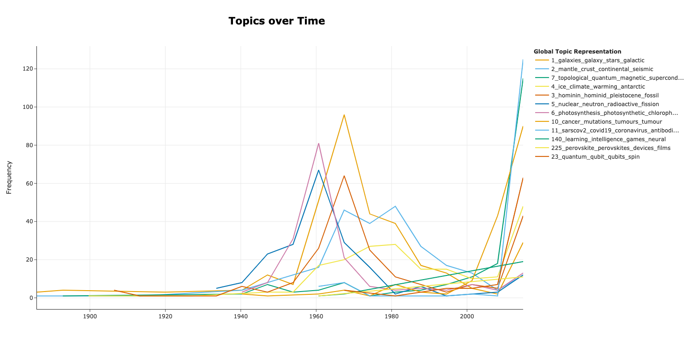

# Nature articles topic modelling
Topic modelling and analysis on Nature published articles since 1873.

* Scraped around 18000 articles from 1873 to 2021.
* Performed EDA on the numerical data and concluded that the pandemic indeed boosts the related researches.
* Utilized Bertopic to the extracted abstracts to investigate the subjects evolution along the history.


<!-- TABLE OF CONTENTS -->
## Table of Contents

* [About the Project](#about-the-project)

* [Getting Started](#getting-started)
  * [Topic modelling](#topic-modelling)
  * [Exploratory Data Analysis](#eda)
  * [Notebooks](#notebooks)
  * [Scripts and Tools](#scripts-and-tools)
  * [Supplementary Data](#supplementary-data)
* [Conclusion](#conclusion)
* [Citation](#citation)
* [Contact](#contact)

<!-- ABOUT THE PROJECT -->
## About The Project

<!--  -->
[Nature](https://www.nature.com/) is one of the most cited scientific journals. Among different types of sections in an issue, [original research articles](https://www.nature.com/nature/articles?type=article) are original reports whose conclusions represent a substantial advance in understanding of an important problem and have immediate, far-reaching implications. The general articles information and corresponding article abstracts were obtained via a scraper. Based on these data, explotary data analysis was performed and topic modelling was performed for further understanding the general scope of th
* [Getting Started](#getting-started)


## Topic Modelling
Explore the [Bertopic](https://github.com/MaartenGr/BERTopic) generated topics over time:


Present the generated topics among the 15000 abstracts:


Pay attention to the topic word scores:


And it's interesting to explore the hierarchical distribustion of the founded topics:


## Exploratory Data Analysis
Obviously, the covid-19 pandemic hindered the development of plenty areas, e.g. business, internationalism. At the beginning of the pandemic, some academic labs are closed and a lot of experiments are delayed. It's interesting to analize whether the pandemic indeed slow down the development of academia.

Topic word score.
After fit and transform, Bertopic generated corresponding embedding space which can be utilized for further analysis. First of all, it's important to know how many topics over the 16276 articles from 1873 to 2021 of the Nature. There are around 240 topics recognized from the abstract pool. For illustration, top 6 topics and three personal interested topics are presented in Fig. 1.


## Citation

```bibtex
@article{devito2020we,
  title={How we learnt to stop worrying and love web scraping},
  author={DeVito, Nicholas J and Richards, G and Inglesby, Peter},
  journal={Nature},
  volume={585},
  year={2020},
  publisher={Nature Research}
}
```

```bibtex
@misc{grootendorst2020bertopic,
  author       = {Maarten Grootendorst},
  title        = {BERTopic: Leveraging BERT and c-TF-IDF to create easily interpretable topics.},
  year         = 2020,
  publisher    = {Zenodo},
  version      = {v0.7.0},
  doi          = {10.5281/zenodo.4381785},
  url          = {https://doi.org/10.5281/zenodo.4381785}
}
```
