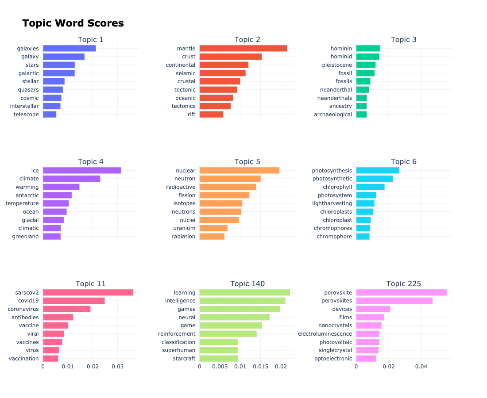
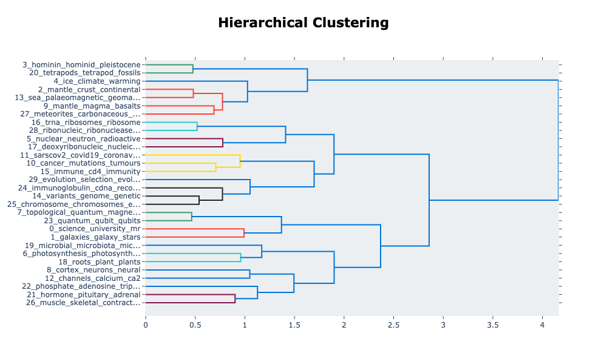

# Nature articles topic modelling
Topic modelling and analysis on Nature published articles since 1873.

* Scraped around 18000 articles from 1873 to 2021.
* Performed EDA on the numerical data and concluded that the pandemic indeed boosts the related researches.
* Utilized Bertopic to the extracted abstracts to investigate the subjects evolution along the history.

<!-- TABLE OF CONTENTS -->
## Table of Contents

* [About the Project](#about-the-project)
  * [Built With](#built-with)
* [Getting Started](#getting-started)
  * [Prerequisites](#prerequisites)
  * [The Story so Far](#the-story-so-far)
  * [Notebooks](#notebooks)
  * [Scripts and Tools](#scripts-and-tools)
  * [Research](#research)
  * [Reporting](#reporting)
  * [Supplementary Data](#supplementary-data)
* [Proposed Updates](#proposed-updates)
* [License](#license)
* [Contact](#contact)

<!-- ABOUT THE PROJECT -->
## About The Project

<!--  -->
[Nature](https://www.nature.com/) is one of the most cited scientific journals. Among different types of sections in an issue, [original research articles](https://www.nature.com/nature/articles?type=article) are original reports whose conclusions represent a substantial advance in understanding of an important problem and have immediate, far-reaching implications. The general articles information and corresponding article abstracts were obtained via a scraper. Based on these data, explotary data analysis was performed and topic modelling was performed for further understanding the general scope of th
* [Getting Started](#getting-started)

## The Story so Far
Explore the [Bertopic](https://github.com/MaartenGr/BERTopic) generated topics over time:

Present the generated topics among the 15000 abstracts:

Pay attention to the topic word scores:

And it's interesting to explore the hierarchical distribustion of the founded topics:

